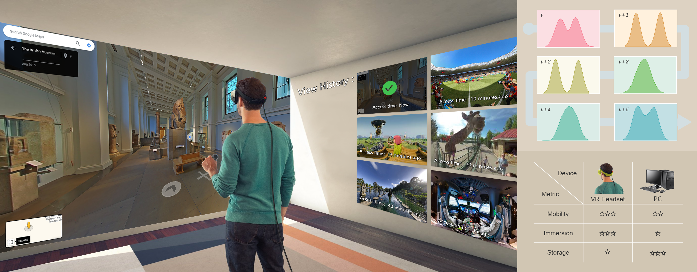
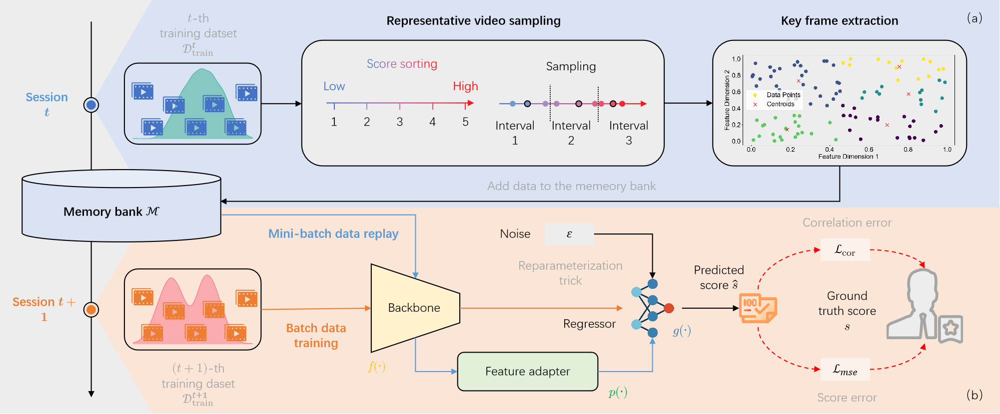

<div align="center">
  <div>
    <h1>
        Adaptive Score Alignment Learning for Continual Perceptual Quality Assessment of 360-Degree Videos in Virtual Reality
    </h1>
  </div>
  <div>
      VR 2024 Submission &emsp; Online Submission ID: 1228
  </div>
  <br/>
</div>

This repository contains the implementation of Adaptive Score Alignment Learning (ASAL), a novel approach designed for Continual Virtual Reality Video Quality Assessment (VR-VQA). 



ASAL leverages feature space smoothing techniques to address the correlation-precision trade-off. Furthermore, we extend ASAL with adaptive memory replay as a Continual Learning (CL) framework. The method aims to adapt to real-world complexities while mitigating limited capacity of VR environments.




## Requirement

- torch==2.0.1
- torchvision==0.15.2
- torchvideotransforms 
- tqdm  
- numpy  
- scipy  
- quadprog

## Usage

### Install dependencies:

```bash
pip install -r requirements.txt
```

### Preparing datasets:

To get started with the experiments, download the MTL-AQA dataset from the [VRVQA](https://github.com/limuhit/VR-Video-Quality-in-the-Wild).


### Pre-trained model:

Downloading: `https://download.pytorch.org/models/resnet18-f37072fd.pth` to `weights/resnet18-f37072fd.pth`.

### Training from scratch:

We provide for training our model in both distributed and dataparallel modes. Here's a breakdown of each command:

1. Train the base model:

```bash
CUDA_VISIBLE_DEVICES=0 python -u main.py \
    --config configs/vrvqw_contlrn.yaml \
    --dataset domain-vrvqw --model base \
    --n_epochs 30 --batch_size 4 \
    --loss_type mix \
    --mse_loss_weight 0.01 \
    --plcc_loss_weight 1 
```

2. Train the joint training model:

```bash
CUDA_VISIBLE_DEVICES=0 python -u main.py \
    --config configs/vrvqw_contlrn.yaml \
    --dataset domain-vrvqw --model base \
    --n_epochs 30 --batch_size 4 \
    --loss_type mix \
    --mse_loss_weight 0.01 \
    --plcc_loss_weight 1 
```

3. Train the continual training model:

```bash
CUDA_VISIBLE_DEVICES=0 python -u main.py \
    --config configs/ours_crat_contlrn.yaml \
    --dataset domain-vrvqw --model ours_cap \
    --n_epochs 15 --batch_size 3 --minibatch_size 2 \
    --fewshot True --fewshot_num 50 \
    --base_pretrain True --buffer_size 30 \
    --loss_type mix --num_key_frames 3 \
    --mse_loss_weight 0.01 --beta 0.1
```

Choose the appropriate command based on your training setup and adjust the configurations as needed.

### Evaluation:

If you want to perform evaluation using the same configurations as training but with the addition of the `--phase test` option,

## Acknowledgements

This repository is based on [mammoth](https://github.com/aimagelab/mammoth), many thanks.

If you have any specific questions or if there's anything else you'd like assistance with regarding the code, feel free to let me know. Good luck with your examination!